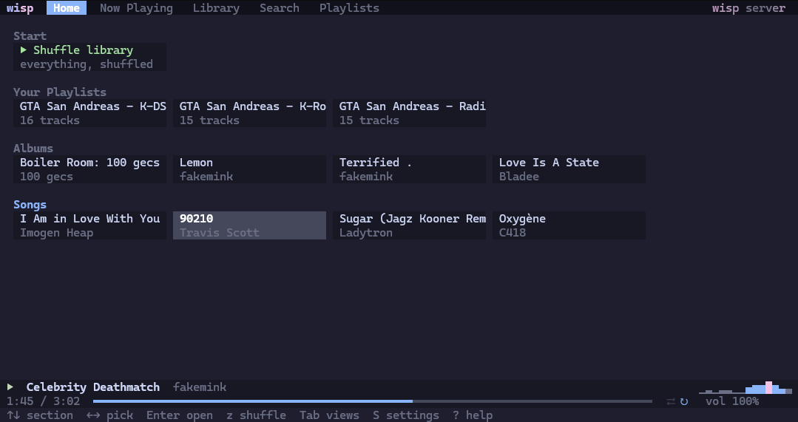
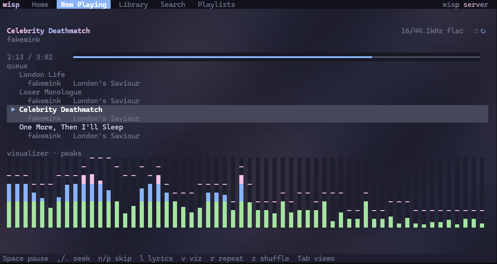
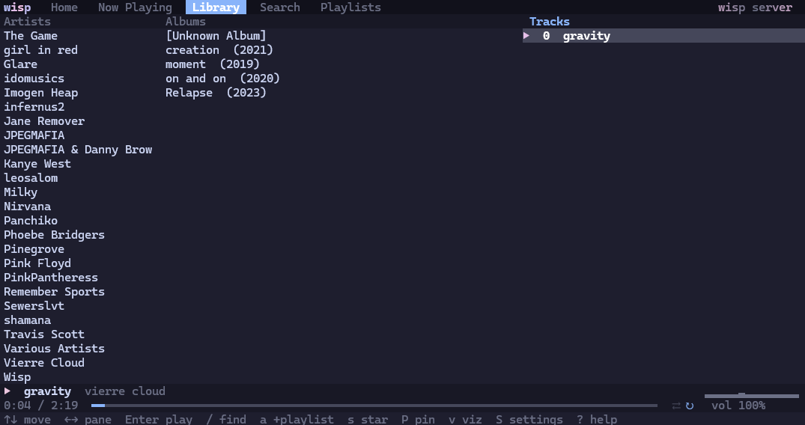

# wisp
a simple, tiny, very fast, cross platform, music streaming tui app for streaming music from navidrome servers, written in c.

## showcase

## why yet another music player
this is a personal tool i wanted for a while. everything else just doesn't fit my needs or it has too many features i don't want that get in the way.

## building wisp
use cmake. wisp should build fine with any recent-ish c compiler, although i have only used clang-cl in testing. 

## extra
if you think i missed anything, found a bug or have any questions, feel free to open an issue. 
if you'd like to contribute a bugfix or a feature, pull requests are always welcome.
